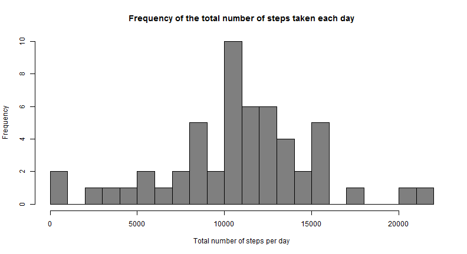
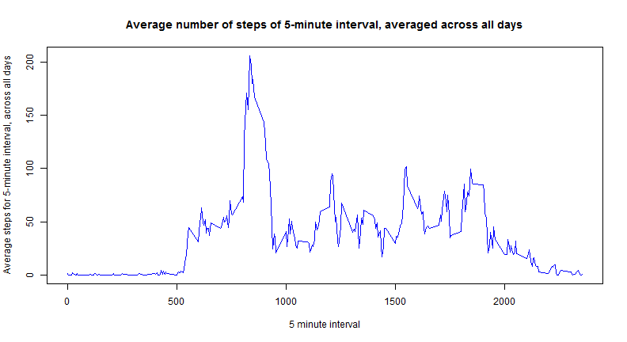
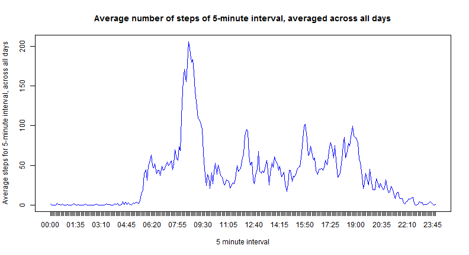
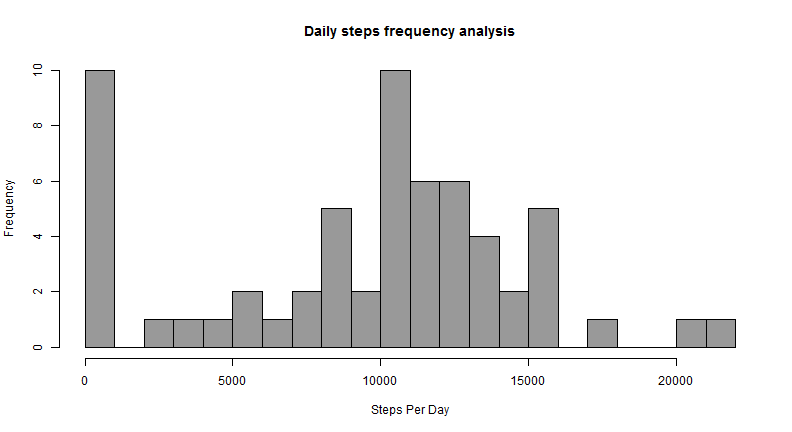
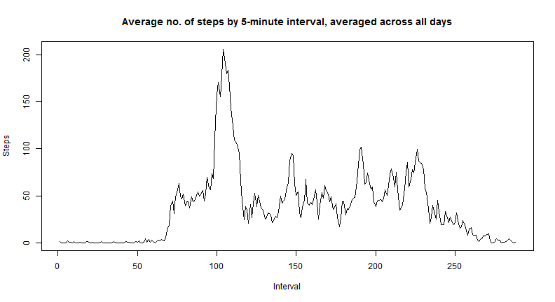
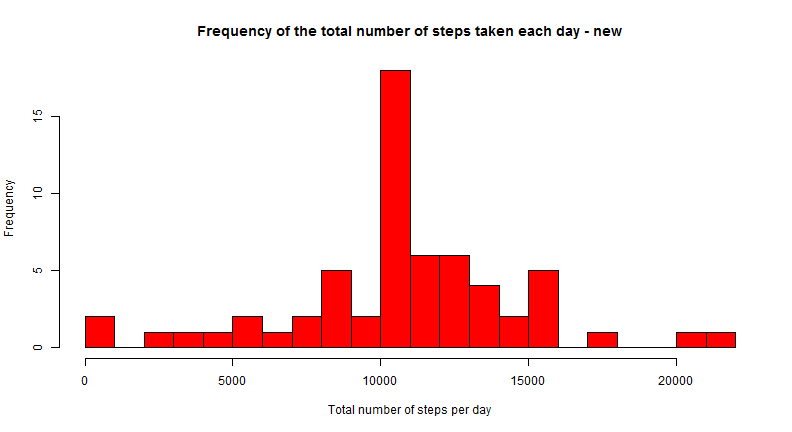
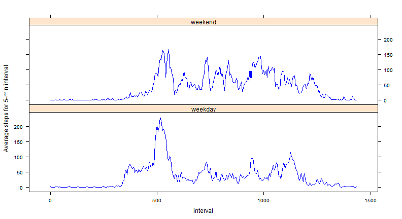
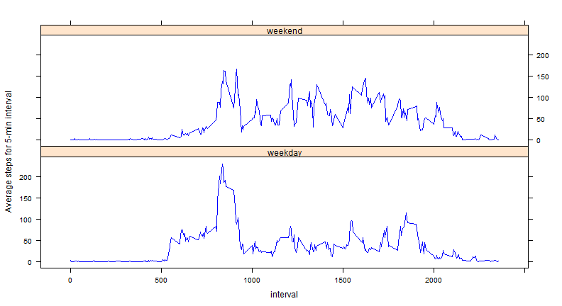
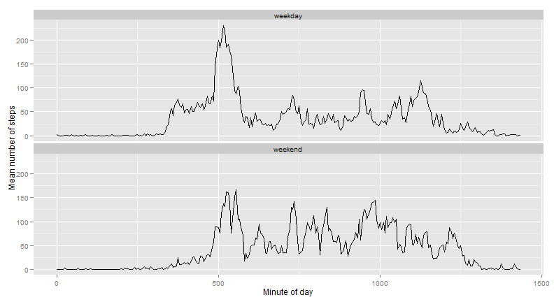

#Reproducible Research: Peer Assessment 1

##Analysis of movement monitoring data

##August 2014

####Summary

This exercise is an analysis of a set of movement monitoring data, where an anonymous individual's steps were recorded at five minute intervals throughout the day. For enhancing of my learning I included options with different graph packages and libraries.

##Data

Data Package is in the file: activity.csv. Original source of data: Activity monitoring data, which was afterwards manually unzipped.

The variables included in this dataset are:

* steps: Number of steps taking in a 5-minute interval (missing values are coded as NA)
* date: The date on which the measurement was taken in YYYY-MM-DD format
* interval: Identifier for the 5-minute interval in which measurement was taken

##Loading and preprocessing the data

1) Load the data, show first lines output and dimension


```r
#unzip("activity.zip")
acData <- read.csv("activity.csv", header=TRUE)
head(acData,5)
```

```
##   steps       date interval
## 1    NA 2012-10-01        0
## 2    NA 2012-10-01        5
## 3    NA 2012-10-01       10
## 4    NA 2012-10-01       15
## 5    NA 2012-10-01       20
```

```r
dim(acData)[1]
```

```
## [1] 17568
```

```r
dim(acData)[2]
```

```
## [1] 3
```

The dataset is stored in a comma-separated-value (CSV) file and there are a total of **17568** observations and **3** variables in this dataset.

2) Process/transform the data to Class Date for analysis


```r
acData$date <- as.Date(acData$date)
```

##What is mean total number of steps taken per day?

1) A histogram of the total number of steps taken each day


```r
acSum <- tapply(acData$steps, acData$date, sum, simplify = TRUE)
hist(acSum, breaks=18, col="gray50", main = "Frequency of the total number of steps taken each day",
     xlab = "Total number of steps per day")
```

 

2) Calculate and report the mean and median total number of steps taken per day

mean of total number of steps taken per day - excluding NA values:


```r
acMean <- mean(acSum, na.rm = TRUE); acMean
```

```
## [1] 10766
```

median of total number of steps taken per day - excluding NA values:

```r
acMedian <- median(acSum, na.rm = TRUE); acMedian
```

```
## [1] 10765
```

##What is the average daily activity pattern?

1) Make a time series plot (i.e. type = "l") of the 5-minute interval (x-axis) and the average number of steps taken, averaged across all days (y-axis)

First plot is a simple plot, the second plot has a more sophisticated x-axis.


```r
acAverage <- tapply(acData$steps, acData$interval, mean, simplify = TRUE, na.rm = TRUE)

plot(names(acAverage), acAverage, type = "l", col="blue", 
     main = "Average number of steps of 5-minute interval, averaged across all days", 
     xlab = "5 minute interval", 
     ylab = "Average steps for 5-minute interval, across all days")
```

 

```r
#That's the second plot
xLabel <- formatC(as.numeric(names(acAverage)), width=4, flag="0")
xLabelstr <- paste0(substr(xLabel,1,2),":",substr(xLabel,3,4))
xlabels <- as.numeric(substr(xLabel,1,2))+as.numeric(substr(xLabel,3,4))/60
plot(xlabels, acAverage, type = "l", col="blue", 
     main = "Average number of steps of 5-minute interval, averaged across all days", 
     xlab = "5 minute interval", ylab = "Average steps for 5-minute interval, across all days", 
     xaxt = "n")
axis(1, xlabels, xLabelstr)
```

 

Other Option with __aggregate()__, which I tried for enhancing my learning

Get summary stats for steps per day:
Aggregate the data. . plot and summarize them . The output from summary() is good enough for the purposes.


```r
dailySteps <- aggregate(acData$steps, 
                        list(acData$date),
                        function( x ){ sum( x, na.rm =TRUE)})
names(dailySteps) <- c("Date", "x")
head (dailySteps)
```

```
##         Date     x
## 1 2012-10-01     0
## 2 2012-10-02   126
## 3 2012-10-03 11352
## 4 2012-10-04 12116
## 5 2012-10-05 13294
## 6 2012-10-06 15420
```

```r
hist(dailySteps$x, breaks = 16, col =' gray60',xlab = "Steps Per Day",
     main = "Daily steps frequency analysis" )
```

 

```r
summary(dailySteps$x)
```

```
##    Min. 1st Qu.  Median    Mean 3rd Qu.    Max. 
##       0    6780   10400    9350   12800   21200
```


2) The 5-minute interval, on average across all the days in the dataset, which contains the maximum number of steps.


```r
maxAve<-max(acAverage, na.rm = TRUE)
x=names(acAverage)
y=acAverage
Ave = cbind(x,y)
maxAsteps<-Ave[y == maxAve]
```

The 5-minute interval, on average across all the days in the dataset, which contains the maximum number of steps is at

```r
maxAsteps[1]
```

```
## [1] "835"
```

```r
maxAsteps[2]
```

```
## [1] "206.169811320755"
```

The mean maximum steps is 206.169811320755 and the 5-minute interval relates to the time 835.


It is also easy to calculate daily average summary using the same general strategy as daily sums .


```r
intervalStepsAvg <- aggregate(acData$steps, list(as.factor(acData$interval)),'mean', na.rm =TRUE)
names(intervalStepsAvg) <- c("Period", "x")
length(intervalStepsAvg$Period)
```

```
## [1] 288
```

```r
head(intervalStepsAvg)
```

```
##   Period       x
## 1      0 1.71698
## 2      5 0.33962
## 3     10 0.13208
## 4     15 0.15094
## 5     20 0.07547
## 6     25 2.09434
```

There are 288 five-minute periods in a day, and the result frame
has 288 rows.


Plotting and analysing the results, 
as before in a simple plot and in a second plot with a better x-axis .


```r
plot(intervalStepsAvg$x, type='l', xlab = 'Interval', ylab = 'Steps',
      main = 'Average no. of steps by 5-minute interval, averaged across all days')
```

 

```r
maxIntervalStep <- which.max(intervalStepsAvg$x)
maxIntervalStep
```

```
## [1] 104
```

```r
head(acData$interval, 10)
```

```
##  [1]  0  5 10 15 20 25 30 35 40 45
```

```r
#Use the more appropiate x-axis as before
plot(xlabels, intervalStepsAvg$x, type = "l", col="blue", 
     main = "Average number of steps of 5-minute interval, averaged across all days", 
     xlab = "5 minute interval", 
     ylab = "Average steps for 5-minute interval, across all days", 
     xaxt = "n")
axis(1, xlabels, xLabelstr)
```

 


Step **104** is 8.5833 hours into the day. The graph looks quite credible i.e. almost no steps in the early morning.

Interval **104** has the largest mean across each date in the dataset, 
with a value of **206.1698**.
In the morning there is more activity, there might be a walk to work.


## Inputing missing values

There are a number of days/intervals where there are missing values (coded as NA). The presence of missing days may introduce bias into some calculations or summaries of the data.

1) Calculate and report the total number of missing values in the dataset (i.e. the total number of rows with NAs)


```r
naSteps <- is.na(acData$steps)
sum(naSteps)
```

```
## [1] 2304
```

Using the __is.na()__ function, there are 2304 missing step counts.

2) Create a new dataset that is equal to the original dataset but with the missing data filled in. Using mean to fill in all of the missing values in the dataset.


```r
newData <- acData
#Using the mean for that 5-minute interval to replace NA of that interval in each day.
for (i in 1:length(acAverage)) {
    newData[(is.na(newData$steps))&(newData$interval==names(acAverage)[i]),]$steps = acAverage[i]
    }
```


3) Make a histogram of the total number of steps taken each day,calculate and report the mean and median total number of steps taken per day. Show the difference of the mean and median compared to the data with NA-values.


```r
newsum <- tapply(newData$steps, newData$date, sum, simplify = TRUE)
hist(newsum, breaks=18, col="red", 
     main = "Frequency of the total number of steps taken each day - new", 
     xlab = "Total number of steps per day")
```

 

```r
acMean2 <- mean(newsum, na.rm = TRUE); acMean2
```

```
## [1] 10766
```

```r
acMedian2 <- median(newsum, na.rm = TRUE); acMedian2
```

```
## [1] 10766
```

```r
acMean2 - acMean
```

```
## [1] 0
```

```r
acMedian2 - acMedian
```

```
## [1] 1.189
```

```r
acMean2-acMedian2
```

```
## [1] 0
```

```r
#days with NA
length(unique(newData$date[naSteps]))
```

```
## [1] 8
```


The mean was used to fill in all of the missing values in the dataset. In the first part of the assignment, with the NA-values exluded, the mean was **1.0766 &times; 10<sup>4</sup>** and the median was **1.0765 &times; 10<sup>4</sup>**.
The mean remains **1.0766 &times; 10<sup>4</sup>**, while the median has increased slightly to **1.0766 &times; 10<sup>4</sup>**. We had **8** days with NAs, but each of these days consisted of NA steps for each interval. So, by setting the NA interval to be the mean for that day, we are adding additional days with step values equal to the mean. Therefore, the mean remains unchanged, while the median is very slightly increased (by 1.1887) and is equal to the mean; a coincidence due to adding numerous days with steps equal exactly to the mean. For the above results, inputing missing data on the estimates makes no difference of the total daily number of steps. Only the frequency of steps between 10000-11000 is higher than the first part of the assignment.

## Are there differences in activity patterns between weekdays and weekends?

1) Create a new factor variable in the dataset with two levels weekday and weekend; indicating whether a given date is a weekday or weekend day.


```r
#Set German weekdays to English weekdays.
Sys.setlocale(locale = "C")
```

```
## [1] "C"
```

```r
## [1] "C"
newData$day <- weekdays(newData$date, abbreviate = TRUE)
newData$weekend <- ifelse((newData$day=="Sat")|(newData$day=="Sun"), c("weekend"), c("weekday"))
# Easier than directly use factor in the ifelse part above
newData$weekend <- factor(newData$weekend)
```


2) Make a panel plot containing a time series plot (i.e. type = "l") of the 5-minute interval (x-axis) and the average number of steps taken, averaged across all weekday days or weekend days (y-axis).

2a) First with the lattice-library


```r
library(lattice)
acAverageWeek <- tapply(newData$steps, list(newData$interval,newData$weekend), mean, simplify = TRUE)
xLabel <- formatC(as.numeric(rownames(acAverageWeek)), width=4, flag="0")
xLabelstr <- paste0(substr(xLabel,1,2),":",substr(xLabel,3,4))
xlabels <- as.numeric(substr(xLabel,1,2))*60 + as.numeric(substr(xLabel,3,4))
avewd<-data.frame(ave = acAverageWeek[,1], interval = c(xlabels), weekend = rep("weekday",288))
avewe<-data.frame(ave = acAverageWeek[,2], interval = c(xlabels), weekend = rep("weekend",288))
avewk<-rbind(avewd,avewe)
avewk <- transform(avewk, weekend = factor(weekend))
xyplot(ave~interval|weekend, data = avewk, type="l", col="blue", layout=c(1,2), 
       ylab="Average steps for 5-min interval")
```

 

2b) Other Option with plyr for easier summarizing the data


```r
library(plyr)
AvData <- ddply(newData, .(interval, weekend), summarize, mean=mean(steps))
xyplot(AvData$mean~interval|weekend, data = AvData, type="l", col="blue", layout=c(1,2), 
       ylab="Average steps for 5-min interval")
```

 

2c) Other Option with ggplot2 - Library

Make a panel plot containing a time series plot (i.e. type = "l") of the 5-minute interval (x-axis) and the average number of steps taken, averaged across all weekday days or weekend days (y-axis).


```r
library(ggplot2)
AvData <- ddply(newData, .(interval, weekend), summarize, mean=mean(steps))

# For the time series plot, I want a variable that represents the number of minutes since midnight
# The interval is a factor and there performing hour-minute concatenation (i.e. 835 => 08:35)
minutes <- 60*floor(AvData$interval/100) + AvData$interval %% 100
AvData <- cbind(AvData, minutes)

# Plot mean steps by interval for Weekday and Weekend
ggplot(AvData) +
  geom_line(aes(minutes, mean)) +
  facet_wrap(~weekend,nrow=2) +
  xlab("Minute of day") + ylab("Mean number of steps")
```

 

There are some pretty obvious differences there:

* Gets up later at weekends (kind of a slower start)  
* Lower morning peak at weekends (possible no walk to work?)  
* More walking during weekends steps throughout the day  
* More late-night activity at weekends  
